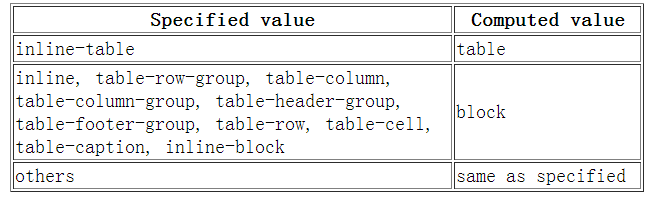

## 1. css sprite是什么，有什么优缺点？
**概念：**将多个小图片拼接到一个图片中。通过background-position和元素尺寸调节需要显示的背景图案

**优点：**

- 减少http请求数，极大的提高页面加载速度
- 增加图片信息重复度，提高压缩比，减小图片大小
- 更换风格方便，只需在一张或几张图片上修改颜色或者样式即可

**缺点：**

- 图片合成麻烦
- 维护麻烦，修改一个图片可能需要重新布局整个图片，样式

## 2.`display:none;`和`visibility:hidden;`的区别？

**联系：**他们都能让元素不可见

**区别：**

- `display:none;`会让元素完全从渲染树中消失，渲染的时候不占据任何空间；`visibility:hidden;`不会让元素从渲染树消失，渲染时元素继续占据空间，只是内容不可见。
- `display:none;`是非继承属性，子孙节点消失是由于父元素从渲染树消失所造成的，通过修改子孙节点属性无法显示；`visibility:hidden;`是继承属性，子孙节点由于继承了hidden而消失，通过设置`visibility:visible;`可以让子孙节点显示。
- 修改常规流中元素的dsiplay通常会造成元素重排。修改visibility属性只会造成本元素重绘。
- 读屏器不会读取`display:none;`元素内容；会读取`visibility:hidden;`内容。

## 3.css hack原理

**原理：**利用不同浏览器对CSS的支持和解析结果不一样编写针对特定浏览器样式。

- 常见的hack有
  - 属性hack
  - 选择器hack
  - IE条件注释

## 4.`link`与`@important`的区别

- `link`是HTML方式，`@important`是css方式
- `link`最大限度支持并行下载，`@important`过多嵌套会导致串行下载，出现 [FOUC]()
- `link`可以通过`rel="alternate stylesheet"`指定候选样式
- 浏览器对`link`支持早于`@important`，可以使用`@important`对老浏览器隐藏样式
- `@important`必须在样式规则之前，可以在css文件中引入其它文件
- 总体来说：**[link 优于@import](https://blog.csdn.net/weixin_42441117/article/details/80705153)**

**FOUC：**由于css引入使用了@import 或者存在多个style标签以及css文件在页面底部引入使得css文件加载在html之后导致页面闪烁、花屏

## 5.`display:block;`与`display:inline;`的区别

**block元素特点**

- 处于常规流中时，如果`width`没有设置，会自动填充满父元素
- 可以应用`margin/padding`
- 在没有设置高度的情况下会扩展高度以包含常规流中的子元素
- 处于常规流中时布局时在前后元素位置之间（独占一个水平空间）
- 忽略`vertical-align`

**inline元素特点**

- 水平方向上根据`direction`依次布局
- 不会在元素前后进行换行
- 受`white-space`控制
- `margin/padding`在竖直方向上无效，水平方向上有效
- `width/height`属性对非替换行内元素无效，宽度由元素内容决定
- 非替换行内元素的行框高由`line-height`确定，替换行内元素的行框高由`height`,`margin`,`padding`,`border`决定
- 浮动或绝对定位时会替换为`block`
- `vertical-align`无效

## 6.`display`,`float`,`position`的关系

- 如果`dsiplay`为`none`,那么`position`和`float`都不起作用，这种情况下元素不产生框
- 否则，如果`position`值为`absolute`或者`fixed`,框就是决定定位的，`float`的计算值为`none`,`display`根据下面的表格调整
- 否则，如果`float`不是`none`，框是浮动的，`display`根据下表进行调整
- 否则，如果元素是根元素，`display`根据下边进行调整
- 其它情况下`display`的值为指定值。总结起来：绝对定位，浮动，根元素都需要调整`display`

## 7.PNG,GIF,JPG 的区别及如何选

**GIF**:

- 8 位像素，256 色
- 无损压缩
- 支持简单动画
- 支持 boolean 透明
- 适合简单动画

**JPEG**：

- 颜色限于 256
- 有损压缩
- 可控制压缩质量
- 不支持透明
- 适合照片

**PNG**：

- 有 PNG8 和 truecolor PNG
- PNG8 类似 GIF 颜色上限为 256，文件小，支持 alpha 透明度，无动画
- 适合图标、背景、按钮

## 8.css有哪些异步属性

- 关于文字排版的属性如：
  - [font](https://developer.mozilla.org/en-US/docs/Web/CSS/font)
  - [word-break](https://developer.mozilla.org/en-US/docs/Web/CSS/word-break)
  - [letter-spacing](https://developer.mozilla.org/en-US/docs/Web/CSS/letter-spacing)
  - [text-align](https://developer.mozilla.org/en-US/docs/Web/CSS/text-align)
  - [text-rendering](https://developer.mozilla.org/en-US/docs/Web/CSS/text-rendering)
  - [word-spacing](https://developer.mozilla.org/en-US/docs/Web/CSS/word-spacing)
  - [white-space](https://developer.mozilla.org/en-US/docs/Web/CSS/white-space)
  - [text-indent](https://developer.mozilla.org/en-US/docs/Web/CSS/text-indent)
  - [text-transform](https://developer.mozilla.org/en-US/docs/Web/CSS/text-transform)
  - [text-shadow](https://developer.mozilla.org/en-US/docs/Web/CSS/text-shadow)
- [line-height](https://developer.mozilla.org/en-US/docs/Web/CSS/line-height)
- [color](https://developer.mozilla.org/en-US/docs/Web/CSS/color)
- [visibility](https://developer.mozilla.org/en-US/docs/Web/CSS/visibility)
- [cursor](https://developer.mozilla.org/en-US/docs/Web/CSS/cursor)

## 9.介绍一下标准的CSS的盒子模型？低版本IE的盒子模型有什么不同的？

- 盒子模型构成：内容(content)、内填充(padding)、 边框(border)、外边距(margin)
- IE8及其以下版本浏览器，未声明 DOCTYPE，内容宽高会包含内填充和边框，称为怪异盒模型(IE盒模型)
- 标准(W3C)盒模型：元素宽度 = width + padding + border + margin
- 怪异(IE)盒模型：元素宽度 = width + margin
- 标准浏览器通过设置 css3 的 box-sizing: border-box 属性，触发“怪异模式”解析计算宽高

## 10.box-sizing 常用的属性有哪些？分别有什么作用？

- box-sizing: content-box;  // 默认的标准(W3C)盒模型元素效果
- box-sizing: border-box;   // 触发怪异(IE)盒模型元素的效果
- box-sizing: inherit;      //  继承父元素 box-sizing 属性的值

## 11.如何创建块级格式化上下文(block formatting context),BFC 有什么用？

**创建规则：**
- 根元素
- 浮动元素（`float`不为`none`）
- 绝对定位元素（`position`取值为`absolute`或`fixed`）
- `display`取值为`inline-block`,`table-cell`, `table-caption`,`flex`, `inline-flex`之一的元素
- `overflow`不是`visible`的元素

**作用：**

- 可以包含浮动元素
- 不被浮动元素覆盖
- 阻止父子元素的 margin 折叠

## 12.css选择器有哪些？

- id选择器        #id
- 类选择器        .class
- 标签选择器      div, h1, p
- 相邻选择器      h1 + p
- 子选择器        ul > li
- 后代选择器      li a
- 通配符选择器    *
- 属性选择器      a[rel='external']
- 伪类选择器      a:hover, li:nth-child

## 13.CSS哪些属性可以继承？哪些属性不可以继承？

- 可以继承的样式：font-size、font-family、color、list-style、cursor
- 不可继承的样式：width、height、border、padding、margin、background

## 14.css如何计算选择器优先？

- 相同权重，定义最近者为准：行内样式 > 内部样式 > 外部样式
- 含外部载入样式时，后载入样式覆盖其前面的载入的样式和内部样式
- 选择器优先级: 行内样式[1000] > id[100] > class[10] > Tag[1]
- 在同一组属性设置中，!important 优先级最高，高于行内样式

## 15.css新增伪类有哪些？

- :root           选择文档的根元素，等同于 html 元素

- :empty          选择没有子元素的元素
- :target         选取当前活动的目标元素
- :not(selector)  选择除 selector 元素意外的元素

- :enabled        选择可用的表单元素
- :disabled       选择禁用的表单元素
- :checked        选择被选中的表单元素

- :after          在元素内部最前添加内容
- :before         在元素内部最后添加内容

- :nth-child(n)      匹配父元素下指定子元素，在所有子元素中排序第n
- :nth-last-child(n) 匹配父元素下指定子元素，在所有子元素中排序第n，从后向前数
- :nth-child(odd)
- :nth-child(even)
- :nth-child(3n+1)
- :first-child
- :last-child
- :only-child

- :nth-of-type(n)      匹配父元素下指定子元素，在同类子元素中排序第n
- :nth-last-of-type(n) 匹配父元素下指定子元素，在同类子元素中排序第n，从后向前数
- :nth-of-type(odd)
- :nth-of-type(even)
- :nth-of-type(3n+1)
- :first-of-type
- :last-of-type
- :only-of-type

- ::selection     选择被用户选取的元素部分
- :first-line     选择元素中的第一行
- :first-letter   选择元素中的第一个字符
