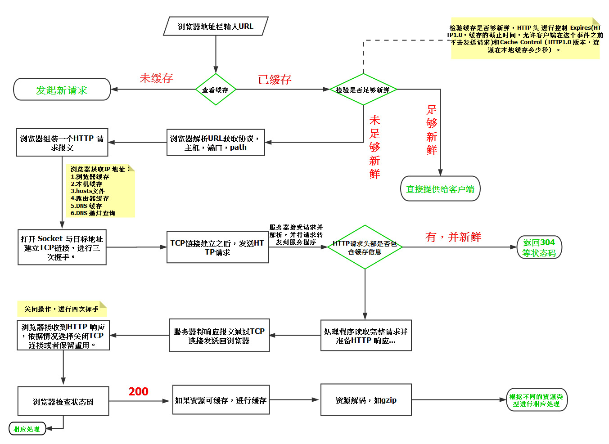
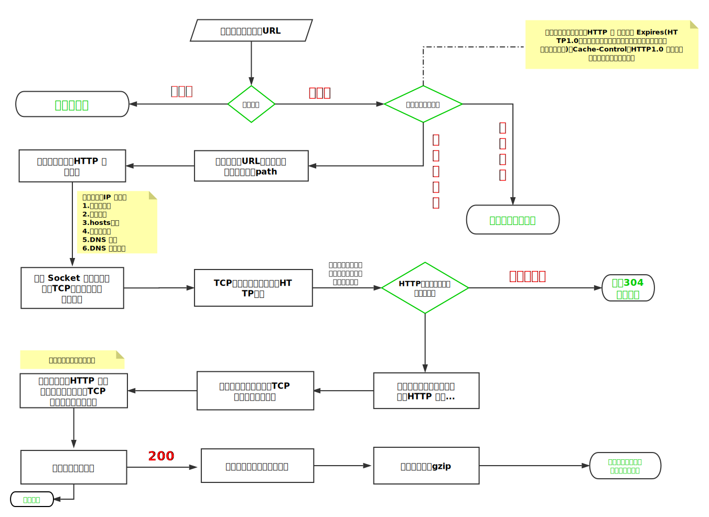

## 1. 前端需要注意哪些SEO
- 合理的`title`、`description`、`keywords`：搜索对着三项的权重逐个减小，title值强调重点即可，重要关键词出现不要超过2次，而且要靠前，不同页面title要有所不同；description把页面内容高度概括，长度合适，不可过分堆砌关键词，不同页面description有所不同；keywords列举出重要关键词即可
- 语义化的HTML代码，符合W3C规范：语义化代码让搜索引擎容易理解网页
- 重要内容HTML代码放在最前：搜索引擎抓取HTML顺序是从上到下，有的搜索引擎对抓取长度有限制，保证重要内容一定会被抓取
- 重要内容不要用js输出：爬虫不会执行js获取内容
- 少用iframe：搜索引擎不会抓取iframe中的内容
- 非装饰性图片必须加alt
- 提高网站速度：网站速度是搜索引擎排序的一个重要指标

## 2.如何做SEO优化?
- 标题与关键词

	- 设置有吸引力切合实际的标题，标题中要包含所做的关键词


- 页面元素

	- 给图片标注"Alt"可以让搜索引擎更友好的收录


- 流量分析
	
	- 通过统计工具(百度统计，CNZZ)分析流量来源，指导下一步的SEO
	
- content方面
	
	- 减少HTTP请求：合并文件、CSS精灵、inline Image
	- 减少DNS查询：DNS缓存、将资源分布到恰当数量的主机名
	- 减少DOM元素数量

- Server方面
	
	- 使用CDN
	- 配置ETag	
	- 对组件使用Gzip压缩

- Javascript方面
	
	- 将脚本放到页面底部
	- 将javascript和css从外部引入
	- 压缩javascript和css
	- 删除不需要的脚本
	- 减少DOM访问

- 图片方面
	
	- 优化图片：根据实际颜色需要选择色深、压缩
	- 优化css精灵
	- 不要在HTML中拉伸图片

## 3.http状态码有那些？分别代表是什么意思？
```
 简单版
    [
        100  Continue   继续，一般在发送post请求时，已发送了http header之后服务端将返回此信息，表示确认，之后发送具体参数信息
        200  OK         正常返回信息
        201  Created    请求成功并且服务器创建了新的资源
        202  Accepted   服务器已接受请求，但尚未处理
        301  Moved Permanently  请求的网页已永久移动到新位置。
        302 Found       临时性重定向。
        303 See Other   临时性重定向，且总是使用 GET 请求新的 URI。
        304  Not Modified 自从上次请求后，请求的网页未修改过。

        400 Bad Request  服务器无法理解请求的格式，客户端不应当尝试再次使用相同的内容发起请求。
        401 Unauthorized 请求未授权。
        403 Forbidden   禁止访问。
        404 Not Found   找不到如何与 URI 相匹配的资源。

        500 Internal Server Error  最常见的服务器端错误。
        503 Service Unavailable 服务器端暂时无法处理请求（可能是过载或维护）。
    ]
```

## 4.一个页面从输入 URL 到页面加载显示完成，这个过程中都发生了什么？（流程说的越详细越好）
- 注：这题胜在区分度高，知识点覆盖广，再不懂的人，也能答出几句，
- 而高手可以根据自己擅长的领域自由发挥，从URL规范、HTTP协议、DNS、CDN、数据库查询、
- 到浏览器流式解析、CSS规则构建、layout、paint、onload/domready、JS执行、JS API绑定等等；

- 详细版：
    - 浏览器会开启一个线程来处理这个请求，对 URL 分析判断如果是 http 协议就按照 Web 方式来处理;
    - 调用浏览器内核中的对应方法，比如 WebView 中的 loadUrl 方法;
    - 通过DNS解析获取网址的IP地址，设置 UA 等信息发出第二个GET请求;
    - 进行HTTP协议会话，客户端发送报头(请求报头);
    - 进入到web服务器上的 Web Server，如 Apache、Tomcat、Node.JS 等服务器;
    - 进入部署好的后端应用，如 PHP、Java、JavaScript、Python 等，找到对应的请求处理;
    - 处理结束回馈报头，此处如果浏览器访问过，缓存上有对应资源，会与服务器最后修改时间对比，一致则返回304;
    - 浏览器开始下载html文档(响应报头，状态码200)，同时使用缓存;
    - 文档树建立，根据标记请求所需指定MIME类型的文件（比如css、js）,同时设置了cookie;
    - 页面开始渲染DOM，JS根据DOM API操作DOM,执行事件绑定等，页面显示完成。

- 简洁版：
    - 浏览器根据请求的URL交给DNS域名解析，找到真实IP，向服务器发起请求；
    - 服务器交给后台处理完成后返回数据，浏览器接收文件（HTML、JS、CSS、图象等）；
    - 浏览器对加载到的资源（HTML、JS、CSS等）进行语法解析，建立相应的内部数据结构（如HTML的DOM）；
    - 载入解析到的资源文件，渲染页面，完成。

## 5.常见排序算法的时间复杂度,空间复杂度


## 6.web 开发中会话跟踪的方法有哪些
- cookie
- session
- url 重写
- 隐藏 input
- ip 地址

## 7.``的`title`和`alt`有什么区别
- `title`是[global attributes](http://www.w3.org/TR/html-markup/global-attributes.html#common.attrs.core)之一，用于为元素提供附加的 advisory information。通常当鼠标滑动到元素上的时候显示。
- `alt`是``的特有属性，是图片内容的等价描述，用于图片无法加载时显示、读屏器阅读图片。可提图片高可访问性，除了纯装饰图片外都必须设置有意义的值，搜索引擎会重点分析。

## 8.doctype 是什么,举例常见 doctype 及特点

- `<!doctype>`声明必须处于 HTML 文档的头部，在`<html>`标签之前，HTML5 中不区分大小写
- `<!doctype>`声明不是一个 HTML 标签，是一个用于告诉浏览器当前 HTMl 版本的指令
- 现代浏览器的 html 布局引擎通过检查 doctype 决定使用兼容模式还是标准模式对文档进行渲染，一些浏览器有一个接近标准模型。
- 在 HTML4.01 中`<!doctype>`声明指向一个 DTD，由于 HTML4.01 基于 SGML，所以 DTD 指定了标记规则以保证浏览器正确渲染内容
- HTML5 不基于 SGML，所以不用指定 DTD

	### 常见 dotype：

- **HTML4.01 strict**：不允许使用表现性、废弃元素（如 font）以及 frameset。声明：`<!DOCTYPE HTML PUBLIC "-//W3C//DTD HTML 4.01//EN" "http://www.w3.org/TR/html4/strict.dtd">`
- **HTML4.01 Transitional**:允许使用表现性、废弃元素（如 font），不允许使用 frameset。声明：`<!DOCTYPE HTML PUBLIC "-//W3C//DTD HTML 4.01 Transitional//EN" "http://www.w3.org/TR/html4/loose.dtd">`
- **HTML4.01 Frameset**:允许表现性元素，废气元素以及 frameset。声明：`<!DOCTYPE HTML PUBLIC "-//W3C//DTD HTML 4.01 Frameset//EN" "http://www.w3.org/TR/html4/frameset.dtd">`
- **XHTML1.0 Strict**:不使用允许表现性、废弃元素以及 frameset。文档必须是结构良好的 XML 文档。声明：`<!DOCTYPE html PUBLIC "-//W3C//DTD XHTML 1.0 Strict//EN" "http://www.w3.org/TR/xhtml1/DTD/xhtml1-strict.dtd">`
- **XHTML1.0 Transitional**:允许使用表现性、废弃元素，不允许 frameset，文档必须是结构良好的 XMl 文档。声明： `<!DOCTYPE html PUBLIC "-//W3C//DTD XHTML 1.0 Transitional//EN" "http://www.w3.org/TR/xhtml1/DTD/xhtml1-transitional.dtd">`
- **XHTML 1.0 Frameset**:允许使用表现性、废弃元素以及 frameset，文档必须是结构良好的 XML 文档。声明：`<!DOCTYPE html PUBLIC "-//W3C//DTD XHTML 1.0 Frameset//EN" "http://www.w3.org/TR/xhtml1/DTD/xhtml1-frameset.dtd">`
- **HTML 5**: `<!doctype html>`

## 9.什么是web语义化，有什么好处？

web语义化是指通过HTML标记表示页面包含的信息，包含了HTML标签的语义化和css命名的语义化。

HTML标签的语义化是指：通过使用包含语义的标签（如h1-h6）恰当的表示文档结构

css命名的语义化是指：为HTML标签添加有意义的class，id补充未表达的语义。如[microformat]通过添加符合规则的class描述信息

- 代码结构：使页面没有css的情况下，也能够呈现出很好的内容结构
- 有利于SEO：爬虫依赖标签来确定关键字的权重，因此可以和搜索引擎建立良好的沟通，帮助爬虫抓取更多的有效信息
- 提升用户体验：例如title，alt可以用于解释名称或者解释图片信息，以及label标签的灵活运用
- 便于团队开发和维护：语义化使得代码更具有可读性，让其他开发人员更加理解你的html结构，减少差异化
- 方便其他设备解析：如屏幕阅读器，移动设备等，以有意义的方式来渲染页面

## 10.HTTP method

根据HTTP标准，HTTP请求可以使用多种请求方式。
HTTP1.0定义了三种请求方法：GET,POST和HEAD方法
HTTP1.1定义了六种请求方法：OPTIONS,PUT,PATCH,DELETE,TRACE和CONNECT方法

- GET：用于请求指定的页面信息，并返回实体主题
- HEAD：类似于GET请求，只不过返回的响应中没有具体的内容，用于获取报头
- POST：向指定资源提交数据进行处理（例如请求表单或上传文件）。数据被包含在请求体中。POST请求可能会导致新的资源的建立或已有资源的修改
- PUT：从客户端向服务端传送的数据取代指定的文档的内容
- DELETE：请求服务器删除指定的资源
- CONNECT：HTTP1.1协议中预留给能够将连接改为管道方式的代理服务器
- OPTIONS：允许客户端查看服务器的性能
- TRACE：回显服务器收到的请求，主要用于测试或诊断
- PATCH：是对PUT方法的补充，用来对已知资源进行局部更新

## 11.从浏览器地址栏输入url到显示页面的步骤

#### 1.域名解析
#### 2.TCP连接
HTTP协议是使用TCP协议作为其传输层协议的，在拿到服务器的ip地址后，浏览器客户端会与服务器建立TCP连接，该过程包括三次握手。
- 第一次握手：建立连接时，客户端向服务端发送请求报文
- 第二次握手：服务器收到请求报文后，如同意连接，则向客户端发送确认报文
- 第三次握手：客户端收到服务器的确认后，再次向服务器给出确认报文，完成连接

三次握手主要是为了防止已经失效的请求报文字段发送给服务器，浪费资源

#### 3.浏览器发送HTTP请求
浏览器构建HTTP请求报文，并通过TCP协议传送到服务器的指定端口。HTTP请求报文一共包括三个部分：
- 请求行：指定HTTP请求的方法，url，HTTP协议版本等
- 请求头：描述浏览器的相关信息，语言，编码等


- 请求正文：当发送POST，PUT等请求时，通常需要向服务器传递数据。这些数据就储存在请求正文中

#### 4.服务器处理HTTP请求
服务器处理HTTP请求，并返回响应报文。响应报文包括三个部门：
- 状态码：略
- 响应头：包含了响应的相关信息，如日期等
- 响应正文：服务器返回给浏览器的文本信息，通常的html，js，css，图片等就包含在这一部门里

#### 5.浏览器页面渲染
浏览器接收到服务器发送过来的响应报文，并开始解析html文档，渲染页面。具体的渲染过程包括：构建DOM树，构建渲染树，定位页面元素，绘制页面元素等。

#### 6.断开TCP连接
客户端与服务器四次挥手，断开tcp连接

- 第一次挥手：客户端想分手，发送消息给服务器
- 第二次挥手：服务器通知客户端已经接收到分手请求，但还没做好分手准备
- 第三次挥手：服务器已经做好分手准备，通知客户端
- 第四次挥手：客户端发送消息给服务器，确定分手，服务器关闭连接


	01.浏览器查找域名对应的IP地址(DNS 查询：浏览器缓存->系统缓存->路由器缓存->ISP DNS 缓存->根域名服务器)
	02.浏览器向 Web 服务器发送一个 HTTP 请求（TCP三次握手）
	03.服务器 301 重定向（从 http://example.com 重定向到 http://www.example.com）
	04.浏览器跟踪重定向地址，请求另一个带 www 的网址
	05.服务器处理请求（通过路由读取资源）
	06.服务器返回一个 HTTP 响应（报头中把 Content-type 设置为 'text/html'）
	07.浏览器进 DOM 树构建
	08.浏览器发送请求获取嵌在 HTML 中的资源（如图片、音频、视频、CSS、JS等）
	09.浏览器显示完成页面
	10.浏览器发送异步请求
	
<details>
<summary>详细版</summary>
<pre><code>
1. 在浏览器地址栏输入 URL
2. 浏览器查看**缓存**，如果请求资源在缓存中并且新鲜，跳转到转码步骤
   1. 如果资源未缓存，发起新请求
   2. 如果已缓存，检验是否足够新鲜，足够新鲜直接提供给客户端，否则与服务器进行验证。
   3. 检验新鲜通常有两个 HTTP 头进行控制`Expires`和`Cache-Control`：
      - HTTP1.0 提供 Expires，值为一个绝对时间表示缓存新鲜日期
      - HTTP1.1 增加了 Cache-Control: max-age=,值为以秒为单位的最大新鲜时间
3. 浏览器**解析 URL**获取协议，主机，端口，path
4. 浏览器**组装一个 HTTP（GET）请求报文**
5. 浏览器**获取主机 ip 地址**，过程如下：
   1. 浏览器缓存
   2. 本机缓存
   3. hosts 文件
   4. 路由器缓存
   5. ISP DNS 缓存
   6. DNS 递归查询（可能存在负载均衡导致每次 IP 不一样）
6. **打开一个 socket 与目标 IP 地址，端口建立 TCP 链接**，三次握手如下：
   1. 客户端发送一个 TCP 的**SYN=1，Seq=X**的包到服务器端口
   2. 服务器发回**SYN=1， ACK=X+1， Seq=Y**的响应包
   3. 客户端发送**ACK=Y+1， Seq=Z**
7. TCP 链接建立后**发送 HTTP 请求**
8. 服务器接受请求并解析，将请求转发到服务程序，如虚拟主机使用 HTTP Host 头部判断请求的服务程序
9. 服务器检查**HTTP 请求头是否包含缓存验证信息**如果验证缓存新鲜，返回**304**等对应状态码
10. 处理程序读取完整请求并准备 HTTP 响应，可能需要查询数据库等操作
11. 服务器将**响应报文通过 TCP 连接发送回浏览器**
12. 浏览器接收 HTTP 响应，然后根据情况选择**关闭 TCP 连接或者保留重用，关闭 TCP 连接的四次握手如下**：
    1. 主动方发送**Fin=1， Ack=Z， Seq= X**报文
    2. 被动方发送**ACK=X+1， Seq=Z**报文
    3. 被动方发送**Fin=1， ACK=X， Seq=Y**报文
    4. 主动方发送**ACK=Y， Seq=X**报文
13. 浏览器检查响应状态吗：是否为 1XX，3XX， 4XX， 5XX，这些情况处理与 2XX 不同
14. 如果资源可缓存，**进行缓存**
15. 对响应进行**解码**（例如 gzip 压缩）
16. 根据资源类型决定如何处理（假设资源为 HTML 文档）
17. **解析 HTML 文档，构件 DOM 树，下载资源，构造 CSSOM 树，执行 js 脚本**，这些操作没有严格的先后顺序，以下分别解释
18. **构建 DOM 树**：
    1. **Tokenizing**：根据 HTML 规范将字符流解析为标记
    2. **Lexing**：词法分析将标记转换为对象并定义属性和规则
    3. **DOM construction**：根据 HTML 标记关系将对象组成 DOM 树
19. 解析过程中遇到图片、样式表、js 文件，**启动下载**
20. 构建**CSSOM 树**：
    1. **Tokenizing**：字符流转换为标记流
    2. **Node**：根据标记创建节点
    3. **CSSOM**：节点创建 CSSOM 树
21. **[根据 DOM 树和 CSSOM 树构建渲染树](https://developers.google.com/web/fundamentals/performance/critical-rendering-path/render-tree-construction)**:
    1. 从 DOM 树的根节点遍历所有**可见节点**，不可见节点包括：1）`script`,`meta`这样本身不可见的标签。2)被 css 隐藏的节点，如`display: none`
    2. 对每一个可见节点，找到恰当的 CSSOM 规则并应用
    3. 发布可视节点的内容和计算样式
22. **js 解析如下**：
    1. 浏览器创建 Document 对象并解析 HTML，将解析到的元素和文本节点添加到文档中，此时**document.readystate 为 loading**
    2. HTML 解析器遇到**没有 async 和 defer 的 script 时**，将他们添加到文档中，然后执行行内或外部脚本。这些脚本会同步执行，并且在脚本下载和执行时解析器会暂停。这样就可以用 document.write()把文本插入到输入流中。**同步脚本经常简单定义函数和注册事件处理程序，他们可以遍历和操作 script 和他们之前的文档内容**
    3. 当解析器遇到设置了**async**属性的 script 时，开始下载脚本并继续解析文档。脚本会在它**下载完成后尽快执行**，但是**解析器不会停下来等它下载**。异步脚本**禁止使用 document.write()**，它们可以访问自己 script 和之前的文档元素
    4. 当文档完成解析，document.readState 变成 interactive
    5. 所有**defer**脚本会**按照在文档出现的顺序执行**，延迟脚本**能访问完整文档树**，禁止使用 document.write()
    6. 浏览器**在 Document 对象上触发 DOMContentLoaded 事件**
    7. 此时文档完全解析完成，浏览器可能还在等待如图片等内容加载，等这些**内容完成载入并且所有异步脚本完成载入和执行**，document.readState 变为 complete,window 触发 load 事件
23. **显示页面**（HTML 解析过程中会逐步显示页面）
</code></pre>
</details>

<!--  -->




## 12.说说TCP传输的三次握手四次挥手策略
[三次握手，四次挥手](https://baijiahao.baidu.com/s?id=1654225744653405133&wfr=spider&for=pc)

- 为了准确无误地把数据送达目标处，TCP协议采用了三次握手策略。用TCP协议把数据包送出去后，TCP不会对传送 后的情况置之不理，它一定会向对方确认是否成功送达。握手过程中使用了TCP的标志：SYN和ACK

- 发送端首先发送一个带SYN标志的数据包给对方。接收端收到后，回传一个带有SYN/ACK标志的数据包以示传达确认信息。 最后，发送端再回传一个带ACK标志的数据包，代表“握手”结束。 若在握手过程中某个阶段莫名中断，TCP协议会再次以相同的顺序发送相同的数据包

**断开一个TCP连接则需要“四次握手”：**

- 第一次挥手：主动关闭方发送一个FIN，用来关闭主动方到被动关闭方的数据传送，也就是主动关闭方告诉被动关闭方：我已经不 会再给你发数据了(当然，在fin包之前发送出去的数据，如果没有收到对应的ack确认报文，主动关闭方依然会重发这些数据)，但是，此时主动关闭方还可 以接受数据

- 第二次挥手：被动关闭方收到FIN包后，发送一个ACK给对方，确认序号为收到序号+1（与SYN相同，一个FIN占用一个序号）

- 第三次挥手：被动关闭方发送一个FIN，用来关闭被动关闭方到主动关闭方的数据传送，也就是告诉主动关闭方，我的数据也发送完了，不会再给你发数据了

- 第四次挥手：主动关闭方收到FIN后，发送一个ACK给被动关闭方，确认序号为收到序号+1，至此，完成四次挥手

**TCP和UDP的区别**

- TCP（Transmission Control Protocol，传输控制协议）是基于连接的协议，也就是说，在正式收发数据前，必须和对方建立可靠的连接。一个TCP连接必须要经过三次“对话”才能建立起来

- UDP（User Data Protocol，用户数据报协议）是与TCP相对应的协议。它是面向非连接的协议，它不与对方建立连接，而是直接就把数据包发送过去！ UDP适用于一次只传送少量数据、对可靠性要求不高的应用环境

## 13.HTTP和HTTPS

- HTTP协议通常承载于TCP协议之上，在HTTP和TCP之间添加一个安全协议层（SSL或TSL），这个时候，就成了我们常说的HTTPS
- 默认HTTP的端口号为80，HTTPS的端口号为443

## 14.GET和POST的区别，何时使用POST？

- GET：一般用于信息获取，使用URL传递参数，对所发送信息的数量也有限制，一般在2000个字符
- POST：一般用于修改服务器上的资源，对所发送的信息没有限制
- GET方式需要使用Request.QueryString来取得变量的值，而POST方式通过Request.Form来获取变量的值。也就是说GET是通过地址栏来传值，而POST是通过提交表单来传值。
- 在一下情况中使用POST
	- 无法使用缓存文件（更新服务器上的文件或数据库）
	- 向服务器发送大量数据（POST没有数据量限制）
	- 发送包含未知字符的用户输入时，POST比GET更稳定也更可靠

## 15.网络分层里七层模型是哪七层？


**业内普遍的分层方式有两种。OSI七层模型 和TCP/IP四层模型。**

- OSI七层模型：物、数、网、传、会、表、应
- TCP/IP四层模型：链、网、传、应

	- 1.物理层：主要定义物理设备标准，如网线的接口类型、光纤的接口类型、各种传输介质的传输速率等。它的主要作用是传输比特流（就是由1、0转化为电流强弱来进行传输，到达目的地后再转化为1、0，也就是我们常说的数模转换与模数转换）。这一层的数据叫做比特。
	- 2.数据链路层：定义了如何让格式化数据以帧为单位进行传输，以及如何让控制对物理介质的访问。这一层通常还提供错误检测和纠正，以确保数据的可靠传输。如：串口通信中使用到的115200、8、N、1
	- 3.网络层：在位于不同地理位置的网络中的两个主机系统之间提供连接和路径选择。Internet的发展使得从世界各站点访问信息的用户数大大增加，而网络层正是管理这种连接的层。
	- 4.传输层：定义了一些传输数据的协议和端口号（WWW端口80等），如：TCP（传输控制协议，传输效率低，可靠性强，用于传输可靠性要求高，数据量大的数据），UDP（用户数据报协议，与TCP特性恰恰相反，用于传输可靠性要求不高，数据量小的数据，如QQ聊天数据就是通过这种方式传输的）。 主要是将从下层接收的数据进行分段和传输，到达目的地址后再进行重组。常常把这一层数据叫做段。
	- 5.会话层：通过传输层(端口号：传输端口接收端口)建立数据传输的通路。主要在你的系统之间发起会话或者接受会话请求（设备之间需要互相认识可以是IP也可以是MAC或者是主机名）。
	- 6.表示层：可确保一个系统的应用层所发送的信息可以被另一个系统的应用层读取。例如，PC程序与另一台计算机进行通信，其中一台计算机使用扩展二一十进制交换码(EBCDIC)，而另一台则使用美国信息交换标准码（ASCII）来表示相同的字符。如有必要，表示层会通过使用一种通格式来实现多种数据格式之间的转换。
	- 7.应用层：是最靠近用户的OSI层。这一层为用户的应用程序（例如电子邮件、文件传输和终端仿真）提供网络服务。

**分层功能示意：**

- OSI七层模型结构体： 物、数、网、传、会、表、应
- TCP/IP 四层模型：数、网、传、应


[网络分层架构](https://blog.csdn.net/qq_38560742/article/details/88398270)

## 16.说说304缓存的原理
- 服务器首先产生ETag,服务器可在稍后使用它来判断页面是否已经被修改。本质上，客户端通过将该记号传回服务器要求服务器验证其（客户端）缓存
- 304是http状态码，服务器用来标识这个文件没修改，不返回内容，浏览器在接受到这个状态码后，会使用浏览器已缓存的文件
- 客户端请求一个页面（A），服务器返回页面（A），并且给A加上一个ETag。客户端展现该页面，并将页面连同ETag一同缓存。客户端再次请求页面A，并将上次请求服务器时返回的ETag一起传递给服务器。服务器检查该ETag，并判断该页面自上次客户端请求之后还未被修改，直接返回响应304和一个空的响应体


