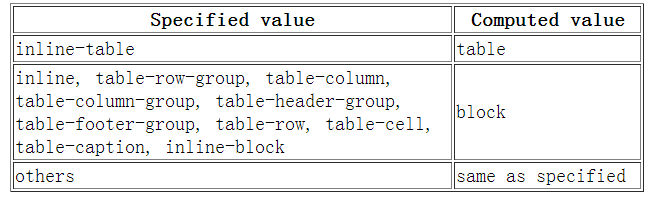

## 1. css sprite是什么，有什么优缺点？
**概念：**将多个小图片拼接到一个图片中。通过background-position和元素尺寸调节需要显示的背景图案

**优点：**

- 减少http请求数，极大的提高页面加载速度
- 增加图片信息重复度，提高压缩比，减小图片大小
- 更换风格方便，只需在一张或几张图片上修改颜色或者样式即可

**缺点：**

- 图片合成麻烦
- 维护麻烦，修改一个图片可能需要重新布局整个图片，样式

## 2.`display:none;`和`visibility:hidden;`的区别？

**联系：**他们都能让元素不可见

**区别：**

- `display:none;`会让元素完全从渲染树中消失，渲染的时候不占据任何空间；`visibility:hidden;`不会让元素从渲染树消失，渲染时元素继续占据空间，只是内容不可见。
- `display:none;`是非继承属性，子孙节点消失是由于父元素从渲染树消失所造成的，通过修改子孙节点属性无法显示；`visibility:hidden;`是继承属性，子孙节点由于继承了hidden而消失，通过设置`visibility:visible;`可以让子孙节点显示。
- 修改常规流中元素的dsiplay通常会造成元素重排。修改visibility属性只会造成本元素重绘。
- 读屏器不会读取`display:none;`元素内容；会读取`visibility:hidden;`内容。

## 3.css hack原理

**原理：**利用不同浏览器对CSS的支持和解析结果不一样编写针对特定浏览器样式。

- 常见的hack有
  - 属性hack
  - 选择器hack
  - IE条件注释

## 4.`link`与`@important`的区别

- `link`是HTML方式，`@important`是css方式
- `link`最大限度支持并行下载，`@important`过多嵌套会导致串行下载，出现 [FOUC]()
- `link`可以通过`rel="alternate stylesheet"`指定候选样式
- 浏览器对`link`支持早于`@important`，可以使用`@important`对老浏览器隐藏样式
- `@important`必须在样式规则之前，可以在css文件中引入其它文件
- 总体来说：**[link 优于@import](https://blog.csdn.net/weixin_42441117/article/details/80705153)**

**FOUC：**由于css引入使用了@import 或者存在多个style标签以及css文件在页面底部引入使得css文件加载在html之后导致页面闪烁、花屏

## 5.`display:block;`与`display:inline;`的区别

**block元素特点**

- 处于常规流中时，如果`width`没有设置，会自动填充满父元素
- 可以应用`margin/padding`
- 在没有设置高度的情况下会扩展高度以包含常规流中的子元素
- 处于常规流中时布局时在前后元素位置之间（独占一个水平空间）
- 忽略`vertical-align`

**inline元素特点**

- 水平方向上根据`direction`依次布局
- 不会在元素前后进行换行
- 受`white-space`控制
- `margin/padding`在竖直方向上无效，水平方向上有效
- `width/height`属性对非替换行内元素无效，宽度由元素内容决定
- 非替换行内元素的行框高由`line-height`确定，替换行内元素的行框高由`height`,`margin`,`padding`,`border`决定
- 浮动或绝对定位时会替换为`block`
- `vertical-align`无效

## 6.`display`,`float`,`position`的关系

- 如果`dsiplay`为`none`,那么`position`和`float`都不起作用，这种情况下元素不产生框
- 否则，如果`position`值为`absolute`或者`fixed`,框就是决定定位的，`float`的计算值为`none`,`display`根据下面的表格调整
- 否则，如果`float`不是`none`，框是浮动的，`display`根据下表进行调整
- 否则，如果元素是根元素，`display`根据下边进行调整
- 其它情况下`display`的值为指定值。总结起来：绝对定位，浮动，根元素都需要调整`display`



## 7.PNG,GIF,JPG 的区别及如何选

**GIF**:

- 8 位像素，256 色
- 无损压缩
- 支持简单动画
- 支持 boolean 透明
- 适合简单动画

**JPEG**：

- 颜色限于 256
- 有损压缩
- 可控制压缩质量
- 不支持透明
- 适合照片

**PNG**：

- 有 PNG8 和 truecolor PNG
- PNG8 类似 GIF 颜色上限为 256，文件小，支持 alpha 透明度，无动画
- 适合图标、背景、按钮

## 8.css有哪些异步属性

- 关于文字排版的属性如：
  - [font](https://developer.mozilla.org/en-US/docs/Web/CSS/font)
  - [word-break](https://developer.mozilla.org/en-US/docs/Web/CSS/word-break)
  - [letter-spacing](https://developer.mozilla.org/en-US/docs/Web/CSS/letter-spacing)
  - [text-align](https://developer.mozilla.org/en-US/docs/Web/CSS/text-align)
  - [text-rendering](https://developer.mozilla.org/en-US/docs/Web/CSS/text-rendering)
  - [word-spacing](https://developer.mozilla.org/en-US/docs/Web/CSS/word-spacing)
  - [white-space](https://developer.mozilla.org/en-US/docs/Web/CSS/white-space)
  - [text-indent](https://developer.mozilla.org/en-US/docs/Web/CSS/text-indent)
  - [text-transform](https://developer.mozilla.org/en-US/docs/Web/CSS/text-transform)
  - [text-shadow](https://developer.mozilla.org/en-US/docs/Web/CSS/text-shadow)
- [line-height](https://developer.mozilla.org/en-US/docs/Web/CSS/line-height)
- [color](https://developer.mozilla.org/en-US/docs/Web/CSS/color)
- [visibility](https://developer.mozilla.org/en-US/docs/Web/CSS/visibility)
- [cursor](https://developer.mozilla.org/en-US/docs/Web/CSS/cursor)

## 9.介绍一下标准的CSS的盒子模型？低版本IE的盒子模型有什么不同的？

- 盒子模型构成：内容(content)、内填充(padding)、 边框(border)、外边距(margin)
- IE8及其以下版本浏览器，未声明 DOCTYPE，内容宽高会包含内填充和边框，称为怪异盒模型(IE盒模型)
- 标准(W3C)盒模型：元素宽度 = width + padding + border + margin
- 怪异(IE)盒模型：元素宽度 = width + margin
- 标准浏览器通过设置 css3 的 box-sizing: border-box 属性，触发“怪异模式”解析计算宽高

## 10.box-sizing 常用的属性有哪些？分别有什么作用？

- `box-sizing: content-box;`  // 默认的标准(W3C)盒模型元素效果
- `box-sizing: border-box;`   // 触发怪异(IE)盒模型元素的效果
- `box-sizing: inherit;`      //  继承父元素 box-sizing 属性的值

## 11.如何创建块级格式化上下文(block formatting context),BFC 有什么用？

- 一个页面是由很多个 Box 组成的,元素的类型和 display 属性,决定了这个 Box 的类型
- 不同类型的 Box,会参与不同的 Formatting Context（决定如何渲染文档的容器）,因此Box内的元素会以不同的方式渲染,也就是说BFC内部的元素和外部的元素不会互相影响
- BFC 也就是常说的块格式化上下文，这是一个独立的渲染区域，规定了内部如何布局， 并且这个区域的子元素不会影响到外面的元素，其中比较重要的布局规则有内部 box 垂 直放置，计算 BFC 的高度的时候，浮动元素也参与计算，触发 BFC 的规则有根元素， 浮动元素，position 为 absolute 或 fixed 的元素，display 为 inline-block，table-cell， table-caption，flex，inline-flex，overflow 不为 visible 的元素

**创建规则：**
- 根元素
- 浮动元素（`float`不为`none`）
- 绝对定位元素（`position`取值为`absolute`或`fixed`）
- `display`取值为`inline-block`,`table-cell`, `table-caption`,`flex`, `inline-flex`之一的元素
- `overflow`不是`visible`的元素

**作用：**

- 可以包含浮动元素
- 不被浮动元素覆盖
- 阻止父子元素的 margin 折叠

## 12.css选择器有哪些？

- id选择器        #id
- 类选择器        .class
- 标签选择器      div, h1, p
- 相邻选择器      h1 + p
- 子选择器        ul > li
- 后代选择器      li a
- 通配符选择器    *
- 属性选择器      a[rel='external']
- 伪类选择器      a:hover, li:nth-child

## 13.CSS哪些属性可以继承？哪些属性不可以继承？

- 可以继承的样式：font-size、font-family、color、list-style、cursor
- 不可继承的样式：width、height、border、padding、margin、background

## 14.css如何计算选择器优先？

- 相同权重，定义最近者为准：行内样式 > 内部样式 > 外部样式
- 含外部载入样式时，后载入样式覆盖其前面的载入的样式和内部样式
- 选择器优先级: 行内样式[1000] > id[100] > class[10] > Tag[1]
- 在同一组属性设置中，!important 优先级最高，高于行内样式

## 15.css新增伪类有哪些？

- :root           选择文档的根元素，等同于 html 元素

- :empty          选择没有子元素的元素
- :target         选取当前活动的目标元素
- :not(selector)  选择除 selector 元素意外的元素

- :enabled        选择可用的表单元素
- :disabled       选择禁用的表单元素
- :checked        选择被选中的表单元素

- :after          在元素内部最前添加内容
- :before         在元素内部最后添加内容

- :nth-child(n)      匹配父元素下指定子元素，在所有子元素中排序第n
- :nth-last-child(n) 匹配父元素下指定子元素，在所有子元素中排序第n，从后向前数
- :nth-child(odd)
- :nth-child(even)
- :nth-child(3n+1)
- :first-child
- :last-child
- :only-child

- :nth-of-type(n)      匹配父元素下指定子元素，在同类子元素中排序第n
- :nth-last-of-type(n) 匹配父元素下指定子元素，在同类子元素中排序第n，从后向前数
- :nth-of-type(odd)
- :nth-of-type(even)
- :nth-of-type(3n+1)
- :first-of-type
- :last-of-type
- :only-of-type

- ::selection     选择被用户选取的元素部分
- :first-line     选择元素中的第一行
- :first-letter   选择元素中的第一个字符

## 16.css3有哪些新特性？

- 新增选择器     p:nth-child(n){color: rgba(255, 0, 0, 0.75)}
- 弹性盒模型     display: flex;
- 多列布局       column-count: 5;
- 媒体查询       @media (max-width: 480px) {.box: {column-count: 1;}}
- 个性化字体     @font-face{font-family: BorderWeb; src:url(BORDERW0.eot);}
- 颜色透明度     color: rgba(255, 0, 0, 0.75);
- 圆角           border-radius: 5px;
- 渐变           background:linear-gradient(red, green, blue);
- 阴影           box-shadow:3px 3px 3px rgba(0, 64, 128, 0.3);
- 倒影           box-reflect: below 2px;
- 文字装饰       text-stroke-color: red;
- 文字溢出       text-overflow:ellipsis;
- 背景效果       background-size: 100px 100px;
- 边框效果       border-image:url(bt_blue.png) 0 10;
- 转换
  - 旋转          transform: rotate(20deg);
  - 倾斜          transform: skew(150deg, -10deg);
  - 位移          transform: translate(20px, 20px);
  - 缩放          transform: scale(.5);
- 平滑过渡       transition: all .3s ease-in .1s;
- 动画           @keyframes anim-1 {50% {border-radius: 50%;}} animation: anim-1 1s;

## 17.position的值relative和absolute定位原点是？

- `absolute`
    - 生成绝对定位的元素，相对于值不为 static的第一个父元素进行定位。
- `fixed` （老IE不支持）
    - 生成绝对定位的元素，相对于浏览器窗口进行定位。
- `relative`
    - 生成相对定位的元素，相对于其正常位置进行定位。
- `static`
    - 默认值。没有定位，元素出现在正常的流中（忽略 top, bottom, left, right - z-index 声明）。
- `inherit`
    - 规定从父元素继承 position 属性的值

## 18.用纯CSS创建一个三角形的原理是什么？

```
// 把上、左、右三条边隐藏掉（颜色设为 transparent）
#demo {
  width: 0;
  height: 0;
  border-width: 20px;
  border-style: solid;
  border-color: transparent transparent red transparent;
}
```

## 19.行内元素float:left后是否变为块级元素？

> 行内元素设置成浮动之后变得更加像是`inline-block`（行内块级元素，设置成这个属性的元素会同时拥有行内和块级的特性，最明显的不同是它的默认宽度不是`100%`），这时候给行内元素设置`padding-top`和`padding-bottom`或者`width`、`height`都是有效果的

## 20.为什么要初始化CSS样式?

- 因为浏览器的兼容问题，不同浏览器对有些标签的默认值是不同的，如果没对CSS初始化往往会出现浏览器之间的页面显示差异

## 21.谈谈浮动和清除浮动?

- 浮动的框可以向左或向右移动，直到他的外边缘碰到包含框或另一个浮动框的边框为止。由于浮动框不在文档的普通流中，所以文档的普通流的块框表现得就像浮动框不存在一样。浮动的块框会漂浮在文档普通流的块框上

- 方法一：使用带 clear 属性的空元素 在浮动元素后使用一个空元素如`<div class="clear"></div>`，并在 CSS 中赋 予.clear{clear:both;}属性即可清理浮动。亦可使用`<br class="clear"/>`或`<hr class="clear"/>`来进行清理。
- 方法二：使用 CSS 的 overflow 属性 给浮动元素的容器添加 overflow:hidden;或 overflow:auto;可以清除浮动，另外在 IE6 中还 需要触发 hasLayout ，例如为父元素设置容器宽高或设置 zoom:1。 在添加 overflow 属性后，浮动元素又回到了容器层，把容器高度撑起，达到了清理浮动 的效果。
- 方法三：给浮动的元素的容器添加浮动 给浮动元素的容器也添加上浮动属性即可清除内部浮动，但是这样会使其整体浮动，影 响布局，不推荐使用。
- 方法四：使用邻接元素处理 什么都不做，给浮动元素后面的元素添加 clear 属性。
- 方法五：使用 CSS 的:after 伪元素 结合:after 伪元素（注意这不是伪类，而是伪元素，代表一个元素之后最近的元素）和 IEhack ，可以完美兼容当前主流的各大浏览器，这里的 IEhack 指的是触发 hasLayout。 给浮动元素的容器添加一个 clearfix 的 class，然后给这个 class 添加一个:after 伪元素实 现元素末尾添加一个看不见的块元素（Block element）清理浮动。

[参考](https://www.cnblogs.com/ForEvErNoME/p/3383539.html)

## 22.li与li之间有看不见的空白间隔是什么原因引起的？有什么解决办法？

- li排列受到中间空白(回车/空格)等的影响，因为空白也属于字符，会被应用样式占据空间，产生间隔
- 解决办法：在ul设置设置font-size=0,在li上设置需要的文字大小

## 23.如何实现图片在某个容器中居中的？

- 父元素固定宽高，利用定位及设置子元素 margin 值为自身的一半。
- 父元素固定宽高，子元素设置`position:absolute;margin:auto;` 平均分配 margin
- css3 属性 transform。子元素设置 `position:absolute; left:50%;top:50%;transform:translate(-50%,-50%);`即可。
- 将父元素设置成 `display:table;` 子元素设置为单元格 `display:table-cell;`
- 弹性布局 `display:flex;`设置 `align-items:center;justify-content:center;`

## 24.如何实现元素的垂直居中？

- 父元素 `display:flex;align-items:center;`
- 元素绝对定位，`top:50%;margin-top:-（高度/2）;`
- 高度不确定用 `transform:translateY（-50%）`
- 父元素 table 布局，子元素设置 `vertical-align:center;`

## 25.display:table 和本身的 table 有什么区别?

- `Display:table` 和本身 table 是相对应的，区别在于，`display:table` 的 css 声明能够让一个 html 元素和它的子节点像 table 元素一样，使用基于表格的 css 布局，是我们能够轻松定义一个单元格的边界，背景等样式，而不会产生因为使用了 table 那样的制表标签导致的语义化问题。
- 之所以现在逐渐淘汰了 table 系表格元素，是因为用 div+css 编写出来的文件比用 table 边写出来的文件小，而且 table 必须在页面完全加载后才显示，div 则是逐行显示，table 的嵌套性太多，没有 div 简洁

## 26.CSS在性能优化方面的实践

- `css`压缩与合并、`Gzip`压缩
- `css`文件放在`head`里、不要用`@import`
- 尽量用缩写、避免用滤镜、合理使用选择器

## 27.几种常见的CSS布局

### 流体布局

```
.left {
	float: left;
	width: 100px;
	height: 200px;
	background: red;
}
.right {
	float: right;
	width: 200px;
	height: 200px;
	background: blue;
}
.main {
	margin-left: 120px;
	margin-right: 220px;
	height: 200px;
	background: green;
}

<div class="container">
	<div class="left"></div>
	<div class="right"></div>
	<div class="main"></div>
</div>
```

### 圣杯布局

- 要求：三列布局；中间主体内容前置，且宽度自适应；两边内容定宽
	- 好处：重要的内容放在文档流前面可以优先渲染
	- 原理：利用相对定位、浮动、负边距布局，而不添加额外标签

```
.container {
	padding-left: 150px;
	padding-right: 190px;
}
.main {
	float: left;
	width: 100%;
}
.left {
	float: left;
	width: 190px;
	margin-left: -100%;
	position: relative;
	left: -150px;
}
.right {
	float: left;
	width: 190px;
	margin-left: -190px;
	position: relative;
	right: -190px;
}

<div class="container">
	<div class="main"></div>
	<div class="left"></div>
	<div class="right"></div>
</div>
```

### 双飞翼布局

- 双飞翼布局：对圣杯布局（使用相对定位，对以后布局有局限性）的改进，消除相对定位布局
- 原理：主体元素上设置左右边距，预留两翼位置。左右两栏使用浮动和负边距归位，消除相对定位。

```
.container {
	/*padding-left:150px;*/
	/*padding-right:190px;*/
}
.main-wrap {
	width: 100%;
	float: left;
}
.main {
	margin-left: 150px;
	margin-right: 190px;
}
.left {
	float: left;
	width: 150px;
	margin-left: -100%;
	/*position: relative;*/
	/*left:-150px;*/
}
.right {
	float: left;
	width: 190px;
	margin-left: -190px;
	/*position:relative;*/
	/*right:-190px;*/
}
    
<div class="content">
	<div class="main"></div>
</div>
<div class="left"></div>
<div class="right"></div>
```

## 28.介绍使用过的 CSS 预处理器？

- CSS 预处理器基本思想：为 CSS 增加了一些编程的特性（变量、逻辑判断、函数等）
- 开发者使用这种语言进行进行 Web 页面样式设计，再编译成正常的 CSS 文件使用
- 使用 CSS 预处理器，可以使 CSS 更加简洁、适应性更强、可读性更佳，无需考虑兼容性
- 最常用的 CSS 预处理器语言包括：Sass（SCSS）和 LESS
- 均具有“变量”、“混合”、“嵌套”、“继承”、“颜色混合”五大基本特性
- `Scss`和`LESS`语法较为严谨，`LESS`要求一定要使用大括号“{}”，`Scss`和`Stylus`可以通过缩进表示层次与嵌套关系
- `Scss`无全局变量的概念，`LESS`和`Stylus`有类似于其它语言的作用域概念
- `Sass`是基于`Ruby`语言的，而`LESS`和`Stylus`可以基于`NodeJS` `NPM`下载相应库后进行编译；

## 29.什么是外边距重叠？重叠的结果是什么？

> 外边距重叠就是margin-collapse

- 在CSS当中，相邻的两个盒子（可能是兄弟关系也可能是祖先关系）的外边距可以结合成一个单独的外边距。这种合并外边距的方式被称为折叠，并且因而所结合成的外边距称为折叠外边距。
- **折叠结果遵循下列计算规则**：

	- 两个相邻的外边距都是正数时，折叠结果是它们两者之间较大的值。
	- 两个相邻的外边距都是负数时，折叠结果是两者绝对值的较大值。
	- 两个外边距一正一负时，折叠结果是两者的相加的和。

## 30.rgba()和opacity的透明效果有什么不同？

- `rgba()`和`opacity`都能实现透明效果，但最大的不同是`opacity`作用于元素，以及元素内的所有内容的透明度，
- 而`rgba()`只作用于元素的颜色或其背景色。（设置`rgba`透明的元素的子元素不会继承透明效果！

## 31.CSS优化、提高性能的方法有哪些？

- 多个css合并，尽量减少HTTP请求
- 将css文件放在页面最上面
- 移除空的css规则
- 避免使用CSS表达式
- 选择器优化嵌套，尽量避免层级过深
- 充分利用css继承属性，减少代码量
- 抽象提取公共样式，减少代码量
- 属性值为0时，不加单位
- 属性值为小于1的小数时，省略小数点前面的0
- css雪碧图

## 32.如何垂直居中一个浮动元素？

> 已知元素宽高

```
#div1{
	background-color:#6699FF;
	width:200px;
	height:200px;
	position: absolute;        //父元素需要相对定位
	top: 50%;
	left: 50%;
	margin-top:-100px ;   //二分之一的height，width
	margin-left: -100px;
}
```
> 未知元素宽高

```
#div1{
	width: 200px;
	height: 200px;
	background-color: #6699FF;
	margin:auto;
	position: absolute;        //父元素需要相对定位
	left: 0;
	top: 0;
	right: 0;
	bottom: 0;
}
```

## 33.px和em的区别

- `px`和`em`都是长度单位，区别是，`px`的值是固定的，指定是多少就是多少，计算比较容易。`em`得值不是固定的，并且`em`会继承父级元素的字体大小。
- 浏览器的默认字体高都是`16px`。所以未经调整的浏览器都符合: `1em=16px`。那么`12px=0.75em`, `10px=0.625em`。

> - px 相对于显示器屏幕分辨率，无法用浏览器字体放大功能
> - em 值并不是固定的，会继承父级的字体大小： em = 像素值 / 父级font-size

## 35.水平居中的方法

- 元素为行内元素，设置父元素`text-align:center`
- 如果元素宽度固定，可以设置左右`margin`为`auto`;
- 绝对定位和移动: `absolute + transform`
- 使用`flex-box`布局，指定`justify-content`属性为center
- `display`设置为`tabel-ceil`

## 36.垂直居中的方法

- 将显示方式设置为表格，`display:table-cell`,同时设置`vertial-align：middle`
- 使用`flex`布局，设置为`align-item：center`
- 绝对定位中设置`bottom:0,top:0`,并设置`margin:auto`
- 绝对定位中固定高度时设置`top:50%，margin-top`值为高度一半的负值
- 文本垂直居中设置`line-height`为`height`值

- 如果是单行文本, line-height 设置成和 height 值
	
	```
	.vertical {
		height: 100px;
		line-height: 100px;
	}
	```
    

- 已知高度的块级子元素，采用绝对定位和负边距

	```
    .container {
		position: relative;
    }
    .vertical {
		height: 300px;  /*子元素高度*/
		position: absolute;
		top:50%;  /*父元素高度50%*/
		margin-top: -150px; /*自身高度一半*/
    }
	```
    

- 未知高度的块级父子元素居中，模拟表格布局
- 缺点：IE67不兼容，父级 overflow：hidden 失效
	
	```
	.container {
		display: table;
	}
	.content {
		display: table-cell;
		vertical-align: middle;
	}
	```
    
    

- 新增 inline-block 兄弟元素，设置 vertical-align
    - 缺点：需要增加额外标签，IE67不兼容

	```
	.container {
		height: 100%;/*定义父级高度，作为参考*/
	}
	.extra .vertical{
		display: inline-block;  /*行内块显示*/
		vertical-align: middle; /*垂直居中*/
	}
	.extra {
		height: 100%; /*设置新增元素高度为100%*/
	}
	```
    

- 绝对定位配合 CSS3 位移

	```
	.vertical {
		position: absolute;
		top:50%;  /*父元素高度50%*/
		transform:translateY(-50%, -50%);
	}
	```
    

- CSS3弹性盒模型

	```
	.container {
		display:flex;
		justify-content: center; /*子元素水平居中*/
		align-items: center; /*子元素垂直居中*/
	}
	```
	
## 37.重绘和回流（重排）是什么，如何避免？

- 重绘：当渲染树中的元素外观（如：颜色）发生改变，不影响布局时，产生重绘
- 回流：当渲染树中的元素的布局（如：尺寸、位置、隐藏/状态状态）发生改变时，产生重绘回流
- 注意：JS获取Layout属性值（如：`offsetLeft`、`scrollTop`、`getComputedStyle`等）也会引起回流。因为浏览器需要通过回流计算最新值
- 回流必将引起重绘，而重绘不一定会引起回流

**如何最小化重绘(repaint)和回流(reflow)：**

- 需要要对元素进行复杂的操作时，可以先隐藏(`display:"none"`)，操作完成后再显示
- 需要创建多个`DOM`节点时，使用`DocumentFragment`创建完后一次性的加入`document`
- 缓存`Layout`属性值，如：`var left = elem.offsetLeft;` 这样，多次使用 `left` 只产生一次回流
- 尽量避免用`table`布局（`table`元素一旦触发回流就会导致table里所有的其它元素回流）
- 避免使用`css`表达式(`expression`)，因为每次调用都会重新计算值（包括加载页面）
- 尽量使用 `css` 属性简写，如：用 `border` 代替 `border-width`, `border-style`, `border-color`
- 批量修改元素样式：`elem.className` 和 `elem.style.cssText` 代替 `elem.style.xxx`